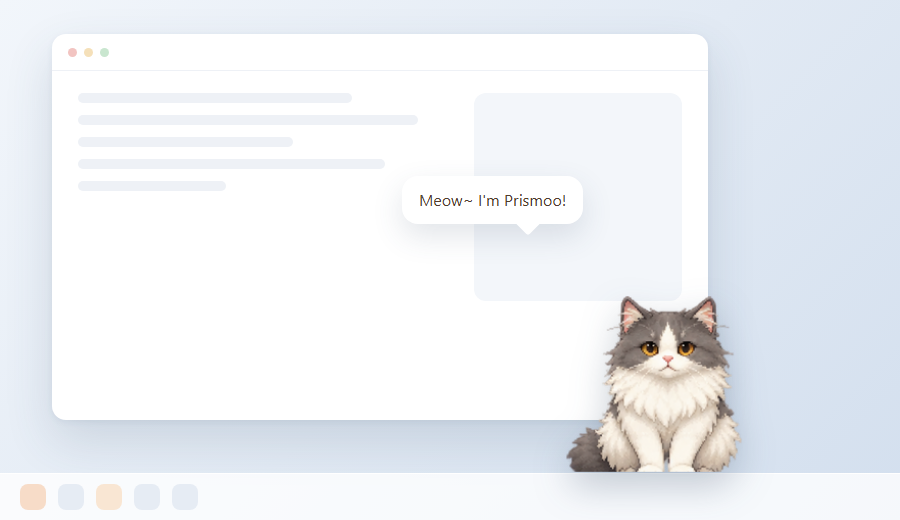
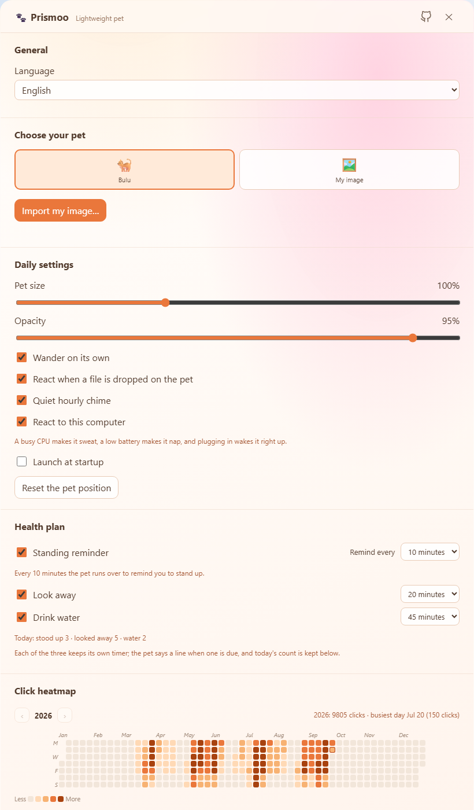

<div align="center">


# Prismoo · Lightweight Desktop Pet

[中文](./README.md) ｜ **English**

A small, transparent pet that lives on your desktop — it walks, naps, and cheers when you drop a photo on it.

[](https://github.com/Aceeee2077/Prismoo/releases)


</div>

## Preview

The pet stays always-on-top, with no taskbar button and no Alt+Tab entry:



Open Settings from the tray or the right-click menu to switch pets, import your own picture, tune size and opacity, and pick the interface language (the panel below is the English UI):



## What it does

- **Bulu, the built-in character** — Bulu is the only bundled look and the default one. Right-click for Wave, Groom, Stretch, Yawn and Scratch: each plays a real pose animation from a 4×5 atlas (`src/assets/animated-pets/bulu-actions.webp` — one action per row, four frames each), not a switched static frame.
- **Bring your own picture** — Choose **Import my image** and the picture goes through a preview first. Background removal is intended for simple, solid backgrounds, and if it would erase the subject Prismoo keeps the original image.
- **Automatic cutout + manual touch-up** — **Refine the cutout…** opens a separate editor window: Rust builds the first mask locally, then the erase / restore brushes fix the edges, with brush size and edge hardness. Undo / redo (Ctrl+Z / Ctrl+Y), wheel zoom, panning, a side-by-side original and a **Run it again** pass (strength and feather) are all there. The picture is never uploaded and the result is saved as a transparent PNG.
- **Drop a file on the pet** — It answers with a short animated line based on the file type: image, document, archive, audio, video, or a general response. Prismoo checks only the extension and never reads or modifies the file. File reactions can be disabled in Settings.
- **Blinking** — While Bulu stands still, both eyes blink together, roughly every 3.2–8.4 seconds and held shut for about 150 ms. The closed-eye frame is painted by `scripts/build-bulu-blink.mjs` out of the resting pose, so it costs no extra atlas art.
- **Touch means different things in different places** — Petting the head melts it into hearts; stroking its back makes it purr and groom; a single tap answers depending on what you poked; a quick double tap gets a happy wave and hearts; holding on too long makes it scratch its head and complain; waking it up with a poke earns a sleepy grumble first.
- **Reminders** — Right-click and pick **Remind me…** (or use the Reminders section in Settings), type a line and a time — a time earlier than now means tomorrow. When it comes due, the pet runs to the middle of the screen and holds up a sign until you touch it. Anything missed by more than ten minutes is dropped rather than announced late.
- **Health plan** — Three habits on their own timers: the standing reminder (on by default), a look-away nudge and a drink-water nudge (the last two start off; turn them on under **Health plan** in Settings). Each interval is presets **plus a custom one**: 5/10/20/30 for standing up, 20/30/60 for looking away and 30/45/60/90 for water — pick "Custom" and type any whole number of minutes from 1 to 240. When one is due the pet says a line — the standing one also runs to the centre of the screen — and the panel keeps a running "today" tally underneath.
- **Click heatmap** — Settings draws every day you clicked the pet over a **whole calendar year** (January 1st to December 31st, 53–54 weeks, no horizontal scrolling): 10 clicks is the lightest shade, then 40 and 70, and 100 or more is the darkest. Days below 10 are drawn empty, but hovering still shows the real count. **Days still to come are drawn too** — empty for now, with a "not yet" tooltip, and they start counting the moment they arrive. Today is the square with the outline — clicking the pet recolours it. The ‹ › arrows step through years (back as far as you have data, never into the future). Days are bucketed by the local calendar date (`src/renderer/lite-day.ts`), so the grid rolls over at midnight on its own — no network clock involved.
- **GitHub button** — The settings title bar carries a GitHub icon: the icon grows and turns blue on hover with a "GitHub" label above it, and clicking it opens this repository in the default browser. The address is a constant in `src-tauri/src/opener.rs` and the command takes no arguments, so the page cannot use it to launch arbitrary links.
- **Aware of this computer** — CPU, memory and battery (system APIs on Windows, the 1-minute load average on macOS): a CPU that stays pinned makes the pet sweat and mutter, a battery below 20% puts a 🪫 badge on it and sends it to nap more often, and plugging in wakes it right up. Turn it off under Daily settings; everything is read locally and nothing is sent anywhere.
- **Sleep and chimes** — While asleep the pet occasionally shows a brief dream bubble, and a quiet hourly speech bubble is on by default. Hours missed while the computer sleeps are not announced later.
- **Chinese / English UI** — Switch the language under Daily settings; the pet's speech bubbles, the right-click menu, the settings panel and the tray tooltip all follow, and your choice is remembered.
- **Auto-update** — An installed build checks for a new version a few seconds after start (can be turned off in Settings), downloads it in the background and lets the pet say so. The **🔄 Update** section in Settings checks manually, shows download progress and restarts into the new version. Packages come from this repository's GitHub Releases and are verified with a minisign signature.
- **Daily settings** — Pet size, opacity, autonomous walking, file-drop reactions, hourly chime, load awareness, launch at login, and reset position; the health plan and the click heatmap have sections of their own.

A single image gets gentle breathing and click motion. It does not become a new set of walking or sleeping poses; Bulu uses frame animation and the pose atlas.

## Use

1. Open Settings from the tray menu.
2. Keep the default Bulu, or choose **Import my image** to use your own picture.
3. Check the preview before selecting **Use this image**. Canceling leaves the current pet untouched.
4. Background removal is intended for simple, solid backgrounds. If it would erase the subject, Prismoo keeps the original image. Transparent PNGs are not processed again.
5. For cleaner edges choose **Refine the cutout…**: pick a brush on the left, drag on the canvas (right-drag or hold space to pan, wheel to zoom), compare the original and the cutout on the right, then press **Use this image**.

## Auto-update

- **Client** — `src-tauri/src/updater.rs` wraps `tauri-plugin-updater` into the `update_get_state / update_check / update_download / update_install / update_install_when_ready` commands. The **🔄 Update** section in Settings and the pet's update bubbles both call them. The feed URL and public key live in `src-tauri/tauri.conf.json` under `plugins.updater`.
- **Release side** — `.github/workflows/release.yml` verifies the signing key on a `v*` tag (or a manual run), builds the NSIS installer with `tauri-action` and publishes the installer plus `latest.json` and `.sig` to Releases. The client's check reads that `latest.json`.
- **Versions** — `package.json`, `src-tauri/Cargo.toml` and `src-tauri/tauri.conf.json` must agree, and a new tag has to be greater than the installed version or the client considers itself up to date.
- **Local packaging** — With `createUpdaterArtifacts` enabled, `npm run dist:win` needs `TAURI_SIGNING_PRIVATE_KEY` / `TAURI_SIGNING_PRIVATE_KEY_PASSWORD` (the same secrets CI uses) or the bundler fails at the signing step. To verify the app locally use `npm run tauri:check`, which needs no key.

## macOS

One codebase, no separate branch: the platform differences live in `tauri.conf.json` and a few `#[cfg(target_os = "macos")]` blocks.

- **Build** — On a Mac: `npm install && npm run dist:mac` (that is `tauri build --bundles dmg,app`). For one binary that runs on both Intel and Apple Silicon: `npx tauri build --target universal-apple-darwin --bundles app,dmg`.
- **Transparent window** — macOS requires `app.macOSPrivateApi` plus the `macos-private-api` cargo feature on `tauri` (both configured). The trade-off: this build cannot ship on the Mac App Store.
- **Dock / menu bar** — The pet runs with the Accessory activation policy, so it takes no Dock or ⌘-Tab slot; the menu-bar icon is a monochrome template image (`src/assets/tray-mac.png`, 22 pt @2x) that inverts itself for light and dark menu bars.
- **Unsigned by default** — The `.dmg` has no Apple certificate, so the first launch needs right-click → Open (or `xattr -dr com.apple.quarantine Prismoo.app`). **macOS auto-update needs a signature too** (it replaces the `.app`); once you have an Apple Developer certificate, add `APPLE_CERTIFICATE` / `APPLE_CERTIFICATE_PASSWORD` / `APPLE_SIGNING_IDENTITY` / `APPLE_ID` / `APPLE_PASSWORD` / `APPLE_TEAM_ID` as repository secrets and uncomment the block in `.github/workflows/release.yml`.
- **Releasing** — A `v*` tag builds Windows x64 and macOS (Apple Silicon and Intel) together and attaches them to one Release; `latest.json` then carries `windows-x86_64`, `darwin-aarch64` and `darwin-x86_64` entries.
- **Verify without releasing** — Run `.github/workflows/build-check.yml` manually: it builds both platforms (updater artifacts off, so no signing key needed), uploads the bundles as artifacts and creates no Release.

## Tech stack

| Layer | Choice | What it does in this build |
| :--- | :--- | :--- |
| Shell | **Tauri 2** | Transparent, borderless, always-on-top window that skips the taskbar; tray icon with a native right-click menu; single instance, launch at login, native file dialogs |
| Backend | **Rust 2021** | Config read/write and migration, window dragging / positioning / multi-monitor edge snapping, click-through, tray, and `include_str!`-embedding the i18n dictionary into the binary |
| Frontend | **TypeScript 5** (no framework) | Eight script files loaded straight from `<script>` tags: pet loop, settings panel, cutout editor window, context menu, Tauri bridge, image import, file-type reactions, i18n runtime |
| i18n | **zh / en dictionaries + `config.locale`** | Strings live in `src/shared/i18n.ts`, are compiled into the Rust side and handed to the pages through the `i18n_get` command — switching the language is one `config_set`, and the tray, bubbles and menus follow |
| Rendering | **Canvas 2D** | Frame-by-frame sprite sheets and pose atlases, the import preview, the mask editor (`destination-out` erase plus a feathered brush), and hit-testing by pixel alpha |
| Asset generation | **Node.js scripts + sharp** | Procedurally generates the pixel sprite sheets and brand icons (PNG / ICO / ICNS), and exports `src/shared/i18n.ts` into the JSON the Rust side reads |
| Packaging | **Tauri CLI** | `npm run dist:win` produces the Windows NSIS installer, `npm run dist:mac` the macOS `.app` / `.dmg`; every icon is generated from one vector source into PNG / ICO / ICNS |
| CI | **GitHub Actions** | A `v*` tag builds Windows x64 and macOS (Apple Silicon + Intel) in parallel, verifies the signing key, and publishes the installers together with the `latest.json` / `.sig` files the updater reads |

## Development

```bash
npm install
npm run build      # sprite sheets + brand icons → tsc → copy renderer assets → export src-tauri/resources/i18n.json
npm test           # lightweight-page behaviour tests (Node) + Rust unit tests
npm run screenshots # regenerate the README images (one set per language; needs Chrome or Edge)
npm run tauri:dev  # run in development mode
npm run dist:win   # build the Windows installer
npm run dist:mac   # build the .app / .dmg on a Mac (a real signature needs an Apple certificate)
```

Requirements: Windows 10/11 with the WebView2 runtime, or macOS 10.15+ (it uses the system WebView); Node.js 20+; Rust 1.77.2+ (only needed to build the Rust side from source).
`npm run tauri:check` builds and launches the real windows for a self-check, so it needs a working Windows WebView2 graphical session.

## Layout

```text
src/renderer/      pet page index.html, settings.html, cutout window mask.html, context menu menu.html
  lite-app.ts      pet loop: animation, blinking, dragging, part-aware touch, sleep, reminders, hourly chime, load reactions
  lite-settings.ts settings panel  ·  lite-mask.ts cutout editor  ·  lite-menu.ts context menu
  lite-day.ts      local calendar days: the bucketing rule behind the daily counters
  lite-api.ts      Tauri bridge (window / config / drag / events)
  lite-image.ts    image import: solid-background cutout and preview
  lite-i18n.ts     language switching: dictionary, {placeholders}, data-i18n markup
src/shared/        types and i18n strings shared by frontend and backend (i18n.ts is the source of truth)
src-tauri/         Rust backend: window, tray, config, custom image, i18n
  cutout.rs        automatic cutout: border colour + flood fill → the initial mask (swap `segment()` for a model)
  load.rs          machine state: CPU / memory / battery (kernel32 on Windows, 1-minute load on macOS)
src/assets/        animation art and brand icons (sprite sheets and icons are generated by npm run build)
scripts/           build, asset generation and test scripts (build-bulu-blink.mjs bakes Bulu's closed-eye frame)
docs/screenshots/  images used by the READMEs
```
