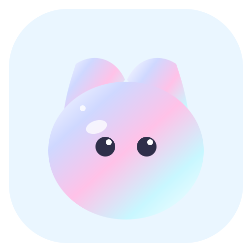

<div align="center">



# Prismoo · Lightweight Desktop Pet

A small, transparent pet that lives on your desktop — it walks, naps, and cheers when you drop a photo on it.

[](https://github.com/Aceeee2077/Prismoo/releases)


</div>

## Preview

The pet stays always-on-top, with no taskbar button and no Alt+Tab entry:


Open Settings from the tray or the right-click menu to switch pets, import your own picture, tune size and opacity, and pick the interface language (the panel below is the English UI):


## What it does

- **Five built-in pets** — Cat, Fox, Rabbit, Bulu and Robot. Right-click for Wave, Groom, Stretch and Yawn; Bulu plays dedicated pose animation (`src/assets/animated-pets/bulu-actions.webp`), while the other pets reuse their existing interaction or sleep frames.
- **Bring your own picture** — Choose **Import my image** and the picture goes through a preview first. Background removal is intended for simple, solid backgrounds, and if it would erase the subject Prismoo keeps the original image.
- **Drop a file on the pet** — It answers with a short animated line based on the file type: image, document, archive, audio, video, or a general response. Prismoo checks only the extension and never reads or modifies the file. File reactions can be disabled in Settings.
- **Pet the head** — Move the pointer gently back and forth over the pet's head to see hearts.
- **Standing reminders** — On by default every 5 minutes, with 10, 20, 30, and custom 1–240 minute intervals. When due, the pet runs to the center of the current screen and asks you to stand up.
- **Sleep and chimes** — While asleep the pet occasionally shows a brief dream bubble, and a quiet hourly speech bubble is on by default. Hours missed while the computer sleeps are not announced later.
- **Chinese / English UI** — Switch the language under Daily settings; the pet's speech bubbles, the right-click menu, the settings panel and the tray tooltip all follow, and your choice is remembered.
- **Daily settings** — Pet size, opacity, autonomous walking, launch at login, and reset position.

A single image gets gentle breathing and click motion. It does not become a new set of walking or sleeping poses. Built-in pets use frame animation.

## Use

1. Open Settings from the tray menu.
2. Select a built-in pet or choose **Import my image**.
3. Check the preview before selecting **Use this image**. Canceling leaves the current pet untouched.
4. Background removal is intended for simple, solid backgrounds. If it would erase the subject, Prismoo keeps the original image. Transparent PNGs are not processed again.

## Tech stack

| Layer | Choice | What it does in this build |
| :--- | :--- | :--- |
| Shell | **Tauri 2** | Transparent, borderless, always-on-top window that skips the taskbar; tray icon with a native right-click menu; single instance, launch at login, native file dialogs |
| Backend | **Rust 2021** | Config read/write and migration, window dragging / positioning / multi-monitor edge snapping, click-through, tray, and `include_str!`-embedding the i18n dictionary into the binary |
| Frontend | **TypeScript 5** (no framework) | Seven script files loaded straight from `<script>` tags: pet loop, settings panel, context menu, Tauri bridge, image cutout, file-type reactions, i18n runtime |
| i18n | **zh / en dictionaries + `config.locale`** | Strings live in `src/shared/i18n.ts`, are compiled into the Rust side and handed to the pages through the `i18n_get` command — switching the language is one `config_set`, and the tray, bubbles and menus follow |
| Rendering | **Canvas 2D** | Frame-by-frame sprite sheets and pose atlases, import preview, and hit-testing by pixel alpha |
| Asset generation | **Node.js scripts + sharp** | Procedurally generates the pixel sprite sheets and brand icons (PNG / ICO / ICNS), and exports `src/shared/i18n.ts` into the JSON the Rust side reads |
| Packaging | **Tauri CLI + NSIS** | `npm run dist:win` produces the Windows installer |
| CI | **GitHub Actions** | A `v*` tag builds, verifies the signing key, and publishes a Release |

## Development

```bash
npm install
npm run build      # sprite sheets + brand icons → tsc → copy renderer assets → export src-tauri/resources/i18n.json
npm test           # lightweight-page behaviour tests (Node) + Rust unit tests
npm run screenshots # regenerate the README images (one set per language; needs Chrome or Edge)
npm run tauri:dev  # run in development mode
npm run dist:win   # build the Windows installer
```

Requirements: Windows 10/11 with the WebView2 runtime, Node.js 20+, and Rust 1.77.2+ (only needed to build the Rust side from source).
`npm run tauri:check` builds and launches the real windows for a self-check, so it needs a working Windows WebView2 graphical session.

## Layout

```text
src/renderer/      pet page index.html, settings.html, context menu menu.html
  lite-app.ts      pet loop: animation, dragging, sleep, standing reminders, hourly chime
  lite-settings.ts settings panel  ·  lite-menu.ts context menu
  lite-api.ts      Tauri bridge (window / config / drag / events)
  lite-image.ts    image import: solid-background cutout and preview
  lite-i18n.ts     language switching: dictionary, {placeholders}, data-i18n markup
src/shared/        types and i18n strings shared by frontend and backend (i18n.ts is the source of truth)
src-tauri/         Rust backend: window, tray, config, custom image, i18n
src/assets/        animation art and brand icons (sprite sheets and icons are generated by npm run build)
scripts/           build, asset generation and test scripts
docs/screenshots/  images used by the READMEs
```

## About this edition

The lightweight pages load only the `lite-*.ts` scripts. The earlier full-featured source and docs (wardrobe, PetPack, AI chat, weather, legacy reminders, statistics, animation debugging) are still kept locally, but they are no longer part of what this repository pushes — see [.gitignore](./.gitignore).

**中文：** [README.md](./README.md)
