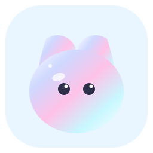
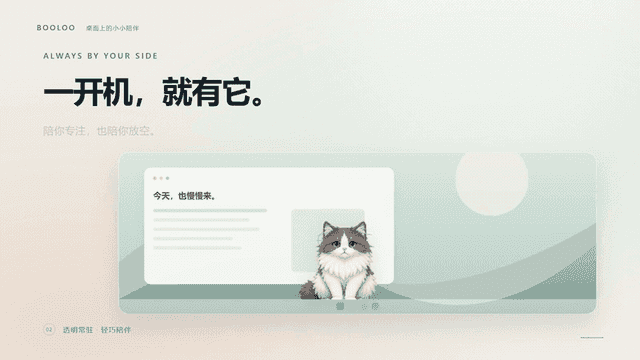

<div align="center">



# Booloo · Lightweight Desktop Pet

**English** ｜ [简体中文](./README.zh-CN.md)

**A tiny transparent cat that lives on top of your windows.** Booloo walks, naps, reacts to what your computer is doing, and turns a photo you drop on it into a pet — locally, with no account and nothing uploaded.

[](https://github.com/Aceeee2077/Booloo/releases)


</div>



## Three things ordinary desktop pets don't do

**1 · Turn any photo into your pet, without it leaving your machine.**
Pick a picture and Rust builds the first cutout mask locally — a border-seeded flood fill, not an upload. If the pass would erase the subject it keeps your original instead of handing you an empty canvas, and **Refine the cutout…** opens a brush editor for whatever is left: erase and restore, brush size and edge hardness, undo/redo, wheel zoom, panning and a side-by-side original. The saved result is a transparent PNG that never touched a server.

**2 · It notices when your computer is tired.**
Booloo reads CPU, memory and battery. A processor that stays pinned makes it sweat and mutter about it; a battery under 20% puts a 🪫 badge on it and sends it to nap more often; plugging in wakes it right back up. All of it is read locally through system APIs — Windows `kernel32`, the 1-minute load average on macOS — and it can be switched off in one click.

**3 · Companionship you can actually measure.**
Petting it, poking it and dropping files on it raise affinity through five levels, from Stranger to Best Friend — and the first interaction of *each day* is worth a bonus, so the score reflects time spent together rather than one long click session. Settings draws every click over a whole calendar year as a heatmap, alongside the days you have been together.

## Install

| Platform | How |
| :--- | :--- |
| **Windows 10/11** | [⬇ Download the latest installer](https://github.com/Aceeee2077/Booloo/releases/latest) — an NSIS `.exe`. Needs the WebView2 runtime (built into Windows 11, a one-time install on 10). |
| **macOS 10.15+** | `Booloo_<version>_aarch64.dmg` (Apple Silicon) or `_x64.dmg` (Intel) from [Releases](https://github.com/Aceeee2077/Booloo/releases/latest). They are **not signed or notarised**, so the first launch needs right-click → Open in Applications, or `xattr -dr com.apple.quarantine /Applications/Booloo.app`. |
| **Linux** | No published bundle yet. The **Build** workflow produces AppImage and deb artifacts on every run (Actions → Build → Artifacts), or build from source below. Heads-up: the CPU / memory / battery awareness is not implemented on Linux yet, so the pet simply stays quiet there. |
| **From source** | `npm install && npm run tauri:dev` — see [Build from source](#build-from-source). |

Nothing else is required: no runtime to install on macOS (it uses the system WebView), no account, no sign-in.

## Why Booloo

| | **Booloo** | Typical desktop pet |
| :--- | :--- | :--- |
| Bring your own photo, with automatic background removal | **Built in** | Rarely, and often server-side |
| Ambient awareness — CPU, memory, battery | **Yes** | No |
| Companionship you can measure (affinity, heatmap, days together) | **Yes** | No |
| Habit nudges: stand up, look away, drink water | **Yes** | Sometimes |
| Your pictures, config and stats | **Stay on your machine — no account, no upload, no telemetry** | Often an account or a cloud service |
| A pet, not another window — no taskbar button, no Alt+Tab entry | **Yes** | Mixed |
| Download size | **~3.6 MB installer** | Tens to hundreds of MB (Electron) |
| Platforms | Windows, macOS, Linux from source | Often Windows only |
| Source | **MIT, the whole thing** | Often closed |

## Preview

### Desktop and settings

The pet stays always-on-top, with no taskbar button and no Alt+Tab entry:


<details>
<summary>Open Settings from the tray or the right-click menu to switch pets, import your own picture, tune size and opacity, and pick the language (click to open the full panel)</summary>


</details>

There is also a [30-second promo GIF](docs/screenshots/booloo-promo.gif) (9 MB, on-screen text in Chinese) that covers the health plan and the affinity panel in more detail.

## What it does

- **Bulu, the built-in character** — Bulu is the only bundled look and the default one. Right-click for Wave, Groom, Stretch, Yawn and Scratch: each plays a real pose animation from a 4×5 atlas (`src/assets/animated-pets/bulu-actions.webp` — one action per row, four frames each), not a switched static frame.
- **Bring your own picture** — Choose **Import my image** and the picture goes through a preview first. Background removal is intended for simple, solid backgrounds, and if it would erase the subject Booloo keeps the original image.
- **Automatic cutout + manual touch-up** — **Refine the cutout…** opens a separate editor window: Rust builds the first mask locally, then the erase / restore brushes fix the edges, with brush size and edge hardness. Undo / redo (Ctrl+Z / Ctrl+Y), wheel zoom, panning, a side-by-side original and a **Run it again** pass (strength and feather) are all there. The picture is never uploaded and the result is saved as a transparent PNG.
- **Drop a file on the pet** — It answers with a short animated line based on the file type: image, document, archive, audio, video, or a general response. Booloo checks only the extension and never reads or modifies the file. File reactions can be disabled in Settings.
- **Blinking** — While Bulu stands still, both eyes blink together, roughly every 3.2–8.4 seconds and held shut for about 150 ms. The closed-eye frame is painted by `scripts/build-bulu-blink.mjs` out of the resting pose, so it costs no extra atlas art.
- **Touch means different things in different places** — Petting the head melts it into hearts; stroking its back makes it purr and groom; a single tap answers depending on what you poked; a quick double tap gets a happy wave and hearts; holding on too long makes it scratch its head and complain; waking it up with a poke earns a sleepy grumble first.
- **Treats and the cat teaser** — Right-click and pick **Feed…** and three treats (dried fish / canned food / milk) appear above its head; click one and it leans down to eat, with hearts and affinity when it finishes. Pick **Cat teaser** instead for a 20-second play session: a feather wand swings over its head, the pet jumps up and swats it, and every catch is worth `+1 ❤️` (up to four) — tap the pet to stop and hear the score. Fullness lives in `config.petStats.hunger`: one point hungrier every four minutes of company, a 🍽️ badge and a line past 75, and a polite refusal when it has just eaten.
- **Reminders** — Right-click and pick **Remind me…** (or use the Reminders section in Settings), type a line and a time — a time earlier than now means tomorrow. When it comes due, the pet runs to the middle of the screen and holds up a sign until you touch it. Anything missed by more than ten minutes is dropped rather than announced late.
- **Health plan** — Three habits on their own timers: the standing reminder (on by default), a look-away nudge and a drink-water nudge (the last two start off). Each interval is presets **plus a custom one**: 5/10/20/30 for standing up, 20/30/60 for looking away and 30/45/60/90 for water — pick "Custom" and type any whole number of minutes from 1 to 240. When one is due the pet says a line — the standing one also runs to the centre of the screen — and the panel keeps a running "today" tally underneath.
- **Click heatmap** — Settings draws every day you clicked the pet over a **whole calendar year** (January 1st to December 31st, 53–54 weeks, no horizontal scrolling): 10 clicks is the lightest shade, then 40 and 70, and 100 or more is the darkest. Days below 10 are drawn empty, but hovering still shows the real count. **Days still to come are drawn too** — empty for now, with a "not yet" tooltip, and they start counting the moment they arrive. Today is the square with the outline. Days are bucketed by the local calendar date (`src/renderer/lite-day.ts`), so the grid rolls over at midnight on its own — no network clock involved.
- **Affinity** — Petting it, poking it, double-tapping and dropping files on it all raise affinity, and the first interaction of a day is worth a bonus +5. A single day is capped at 40 points. There are five levels from "Stranger" to "Best Friend" (0 / 60 / 200 / 500 / 1000); levelling up gets a 🎉 bubble and hearts, and every gain shows a small `+n ❤️` chip floating off the pet. Settings shows the level, a bar towards the next one and the days-together / first-day / lifetime-click numbers, and the right-click menu prints the level too.
- **Aware of this computer** — CPU, memory and battery (system APIs on Windows, the 1-minute load average on macOS): a CPU that stays pinned makes the pet sweat and mutter, a battery below 20% puts a 🪫 badge on it and sends it to nap more often, and plugging in wakes it right up. Turn it off under Daily settings; everything is read locally and nothing is sent anywhere.
- **Sleep and chimes** — While asleep the pet occasionally shows a brief dream bubble, and a quiet hourly speech bubble is on by default. Hours missed while the computer sleeps are not announced later.
- **Chinese / English UI** — Switch the language under Daily settings; the pet's speech bubbles, the right-click menu, the settings panel and the tray tooltip all follow, and your choice is remembered.
- **Auto-update** — An installed build checks for a new version a few seconds after start (can be turned off in Settings), downloads it in the background and lets the pet say so. The **🔄 Update** section in Settings checks manually, shows download progress and restarts into the new version. Packages come from this repository's GitHub Releases and are verified with a minisign signature.
- **Daily settings** — Pet size, opacity, autonomous walking, file-drop reactions, hourly chime, load awareness, launch at login, and reset position.

A single imported image gets gentle breathing and click motion. It does not become a new set of walking or sleeping poses; Bulu uses frame animation and the pose atlas.

## Use

1. Open Settings from the tray menu.
2. Keep the default Bulu, or choose **Import my image** to use your own picture.
3. Check the preview before selecting **Use this image**. Canceling leaves the current pet untouched.
4. Background removal is intended for simple, solid backgrounds. If it would erase the subject, Booloo keeps the original image. Transparent PNGs are not processed again.
5. For cleaner edges choose **Refine the cutout…**: pick a brush on the left, drag on the canvas (right-drag or hold space to pan, wheel to zoom), compare the original and the cutout on the right, then press **Use this image**.

## Privacy

There is no telemetry, no analytics, no account and no cloud service. The only network request Booloo ever makes is the automatic update check against this repository's GitHub Releases, and you can turn that off in Settings → **🔄 Update**. Your pictures live in your own app-data folder, the config file is a plain JSON document you can read and edit, and nothing about your machine leaves it — CPU, memory and battery are sampled and immediately discarded.

## Auto-update

An installed build checks for and installs a new version a few seconds after start, and the **🔄 Update** section in Settings can check manually or turn it off. Packages come from this repository's GitHub Releases and are verified with a minisign signature (client `src-tauri/src/updater.rs`, release side `.github/workflows/release.yml`).

## Build from source

```bash
npm install
npm run tauri:dev      # run it
npm run dist:win       # Windows NSIS installer
npm run dist:mac       # macOS .app / .dmg (a real signature needs an Apple certificate)
npm run dist:linux     # Linux AppImage / deb
```

Requirements: Node.js 20+, Rust 1.77.2+, and a platform webview — WebView2 on Windows 10/11, the system WebView on macOS 10.15+, WebKitGTK on Linux.

Because the macOS builds are unsigned, the first launch needs right-click → Open, or:

```bash
xattr -dr com.apple.quarantine /Applications/Booloo.app
```

## Tech stack

| Layer | Choice | What it does in this build |
| :--- | :--- | :--- |
| Shell | **Tauri 2** | Transparent, borderless, always-on-top window that skips the taskbar; tray icon with a native right-click menu; single instance, launch at login, native file dialogs |
| Backend | **Rust 2021** | Config read/write and migration, window dragging / positioning / multi-monitor edge snapping, click-through, tray, the cutout pass, and `include_str!`-embedding the i18n dictionary into the binary |
| Frontend | **TypeScript 5** (no framework) | Eight script files loaded straight from `<script>` tags: pet loop, settings panel, cutout editor window, context menu, Tauri bridge, image import, file-type reactions, i18n runtime |
| i18n | **zh / en dictionaries + `config.locale`** | Strings live in `src/shared/i18n.ts`, are compiled into the Rust side and handed to the pages through the `i18n_get` command — switching the language is one `config_set`, and the tray, bubbles and menus follow |
| Rendering | **Canvas 2D** | Frame-by-frame sprite sheets and pose atlases, the import preview, the mask editor (`destination-out` erase plus a feathered brush), and hit-testing by pixel alpha |
| Asset generation | **Node.js scripts + sharp** | Procedurally generates the pixel sprite sheets and brand icons (PNG / ICO / ICNS), and exports `src/shared/i18n.ts` into the JSON the Rust side reads |
| Packaging | **Tauri CLI** | `npm run dist:win` produces the Windows NSIS installer, `dist:mac` the `.app` / `.dmg`, `dist:linux` the AppImage / deb; every icon is generated from one vector source |
| CI | **GitHub Actions** | Tests on Windows and macOS for every push and pull request; a **Build** workflow packages Windows, macOS and Linux on every pull request and uploads them as artifacts; a `v*` tag builds Windows and macOS, verifies the signing key, and publishes the installers with the `latest.json` / `.sig` files the updater reads |

## Development

```bash
npm install
npm run build      # sprite sheets + brand icons → tsc → copy renderer assets → export src-tauri/resources/i18n.json
npm test           # lightweight-page behaviour tests (Node) + Rust unit tests
npm run screenshots # regenerate the README images (one set per language; needs Chrome or Edge)
npm run tauri:dev  # run in development mode
```

`npm run tauri:check` builds and launches the real windows for a self-check, so it needs a working Windows WebView2 graphical session.

## Layout

```text
src/renderer/      pet page index.html, settings.html, cutout window mask.html, context menu menu.html
  lite-app.ts      pet loop: animation, blinking, dragging, part-aware touch, sleep, reminders, hourly chime, load reactions
  lite-settings.ts settings panel  ·  lite-mask.ts cutout editor  ·  lite-menu.ts context menu
  lite-care.ts     treats and the cat teaser: hunger maths, the three foods, tray layout, play timing
  lite-day.ts      local calendar days: the bucketing rule behind the daily counters
  lite-api.ts      Tauri bridge (window / config / drag / events)
  lite-image.ts    image import: loading, bounds and validation
  lite-i18n.ts     language switching: dictionary, {placeholders}, data-i18n markup
src/shared/        types and i18n strings shared by frontend and backend (i18n.ts is the source of truth)
src-tauri/         Rust backend: window, tray, config, custom image, i18n
  cutout.rs        automatic cutout: border colour + flood fill → the initial mask (swap `segment()` for a model)
  load.rs          machine state: CPU / memory / battery (kernel32 on Windows, 1-minute load on macOS)
src/assets/        animation art and brand icons (sprite sheets and icons are generated by npm run build)
scripts/           build, asset generation and test scripts (build-bulu-art.mjs assembles the atlases)
docs/              README images, the demo GIF, and docs/RECORDING.md for replacing it
```

## Community

- **Share your pet** — imported a photo of your own cat or dog? Post it in [Discussions](https://github.com/Aceeee2077/Booloo/discussions) so other people can see what the cutout can do.
- **Found a bug or want a feature?** The [issue templates](https://github.com/Aceeee2077/Booloo/issues/new/choose) ask for the two things that actually help: your OS and whether you ran the dev build or the installer.
- **Want to contribute?** [CONTRIBUTING.md](.github/CONTRIBUTING.md) has the dev loop, and [CODE_OF_CONDUCT.md](.github/CODE_OF_CONDUCT.md) the house rules. Art, translations and docs are just as welcome as code.

## If Booloo is useful to you

Booloo is MIT, has no ads and no account, and one person maintains it. A **star** costs you a click and it is the single thing that helps other people find the project — so if the cat made your desktop a little warmer, please ⭐ it.
