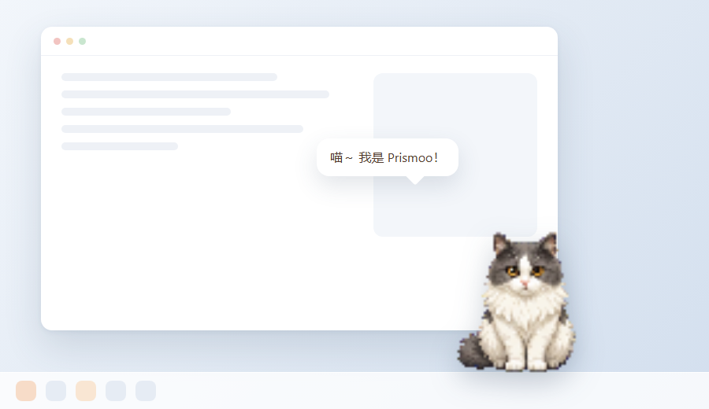
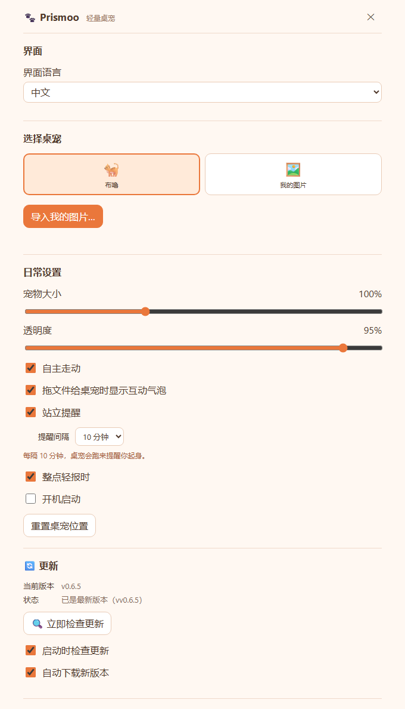

<div align="center">


# Booloo · 轻量桌宠

[English](./README.md) ｜ **简体中文**

**一只常驻在窗口最上层的透明小猫。** 布噜会走动、会打瞌睡、会对你电脑的状态做出反应，也会把拖给它的一张照片变成桌宠——全部在本机完成，不用登录，也不上传。

[](https://github.com/Aceeee2077/Booloo/releases)


</div>


## 三件普通桌宠做不到的事

**1 · 把任意一张照片变成你的桌宠，而且不出本机。**
选好图片后，Rust 在本地生成第一版抠图蒙版（边框取色 + 泛洪填充），不是上传到服务器。如果自动抠图会把主体吃掉，它会保留你的原图而不是交给你一张空白；剩下的部分交给 **手动微调抠图…**：擦除 / 恢复笔刷、笔刷大小与边缘硬度、撤销重做、滚轮缩放、平移和原图对比。最终保存的是一张透明 PNG，全程没有离开过你的电脑。

**2 · 它知道你电脑累了。**
Booloo 会读 CPU、内存和电池。处理器持续吃紧它会出汗并嘟囔一句；电量低于 20% 会挂着 🪫 标记、打盹更频繁；插上电源立刻精神起来。全部通过系统 API 本地读取（Windows 走 `kernel32`，macOS 读 1 分钟负载），一键就能关掉。

**3 · 陪伴是可以量化的。**
摸它、戳它、拖文件给它都会涨好感度，五档从「陌生」到「挚友」；**每天第一次**互动额外加分，所以分数是"处出来的"而不是一晚点出来的。设置页会把你的每一次点击按**自然年**铺成一张热力图，旁边还有你们一起度过的天数。

## 下载

| 平台 | 方式 |
| :--- | :--- |
| **Windows 10/11** | [⬇ 到 Releases 下载最新安装包](https://github.com/Aceeee2077/Booloo/releases/latest)（NSIS `.exe`）。需要 WebView2 运行时（Win11 自带，Win10 需装一次） |
| **macOS 10.15+** | Releases 里有 `Booloo_<版本>_aarch64.dmg`（Apple Silicon）和 `_x64.dmg`（Intel）。**未签名也未公证**，首次打开需在「应用程序」里**右键 → 打开**，或执行 `xattr -dr com.apple.quarantine /Applications/Booloo.app` |
| **Linux** | 暂未提供正式包，先按下文源码构建；*Build check* workflow 也会产出 AppImage / deb 作为可下载的构建产物 |
| **从源码构建** | `npm install && npm run tauri:dev`，见[源码构建](#源码构建) |

除此之外没有别的前置条件：macOS 用系统 WebView 无需额外运行时，不用注册账号，也不用登录。

## 为什么是 Booloo

| | **Booloo** | 常见的桌宠 |
| :--- | :--- | :--- |
| 导入自己的图片 + 自动抠图 | **内置** | 很少见，且多数在服务端处理 |
| 感知电脑状态（CPU / 内存 / 电量） | **有** | 没有 |
| 可量化的陪伴（好感度 / 热力图 / 陪伴天数） | **有** | 没有 |
| 健康提醒：站立、护眼、喝水 | **有** | 偶尔有 |
| 你的图片、配置与统计 | **全部留在本机——不注册、不上传、无遥测** | 常需要账号或依赖云服务 |
| 是桌宠而不是又一个窗口：不占任务栏、不进 Alt+Tab | **是** | 参差不齐 |
| 安装包体积 | **约 3.6 MB** | 几十 MB 到几百 MB（Electron） |
| 平台 | Windows、macOS，Linux 可源码构建 | 常只有 Windows |
| 源码 | **MIT，完整开放** | 常为闭源 |

## 预览

### 桌面与设置

桌宠常驻在最上层，不占任务栏、不进 Alt+Tab：



<details>
<summary>从托盘菜单或右键菜单打开设置，换宠物、导入自己的图片、调大小与透明度（点开看完整面板）</summary>



</details>

另有一支 [30 秒完整宣传片](docs/screenshots/booloo-promo.gif)（约 9 MB，画面文案为中文），里面更完整地展示了健康计划与好感度面板。

## 功能

- **内置布噜** — 布噜是唯一的自带角色，也是默认形象；右键的「挥爪」「舔爪」「伸懒腰」「打哈欠」「挠头」播放的是真实姿势动画（`src/assets/animated-pets/bulu-actions.webp`，4×5 姿势图集：每行一个动作、四个帧），不是换个静止帧。
- **换成自己的图片** — 图片先进入预览，确认画面完整后再替换；可选「去掉纯色背景」，抠图若会使主体消失，应用会保留原图。
- **自动抠图 + 手动微调** — 预览里点「手动微调抠图…」打开独立编辑窗口：Rust 后端先在本地生成初始蒙版，再用「擦除背景 / 恢复主体」笔刷修边缘，可调笔刷大小与边缘硬度；支持撤销 / 重做（Ctrl+Z / Ctrl+Y）、滚轮缩放、平移、原图对比和「重新抠图」（可调强度与羽化）。图片不上传，保存结果是透明 PNG。
- **拖文件互动** — 把文件拖到桌宠身上，它会按图片、文档、压缩包、音乐或视频说一句话并做出短暂动作。只识别扩展名，不读取或改动文件内容；可在「日常设置」关闭。
- **眨眼** — 布噜站着不动时，两只眼睛会一起眨一下（约 3.2～8.4 秒一次，闭眼约 150 毫秒）。闭眼帧是 `scripts/build-bulu-blink.mjs` 从待机帧自己画出来的，不额外占用图集。
- **分区互动** — 摸头会冒爱心；摸背它会呼噜一声并舔爪；戳一下按部位给不同回应；快速双击它会开心地挥爪冒出爱心；按住不放它会挠头抗议；睡着时戳它会先醒过来再抱怨一句。
- **投喂与逗猫棒** — 右键选「喂食…」，它头顶会冒出小鱼干 / 猫罐头 / 牛奶三个托盘，点一个它就低头吃掉，吃完冒爱心、涨好感度；右键选「逗猫棒」则开始一局 20 秒的玩耍，羽毛棒在它头顶晃，它会跳起来拍，每拍中一次 `+1 ❤️`（最多四次），再点它一下就收工并汇报战果。饱腹值存在 `config.petStats.hunger`：陪着你的时候每 4 分钟长一点，超过 75 它会在头顶挂个 🍽️ 并嘟囔一句，刚吃饱则会拒绝下一份。
- **待办提醒** — 右键选「提醒…」，或在设置的「待办提醒」里写一句话加一个时间（早于此刻的时间按明天算），到点桌宠会跑到屏幕中央举牌提醒你，点一下它就收起牌子。错过太久的提醒（超过 10 分钟）不会事后补报。
- **健康计划** — 三件事各自独立计时：站立提醒（默认开启、5 分钟）、护眼、喝水（后两项默认关闭）。三者的间隔都是**预设 + 自定义**：站立 5/10/20/30，护眼 20/30/60，喝水 30/45/60/90，选「自定义」再填 1～240 之间的整数分钟。到点桌宠会来说一句——站立提醒还会跑到屏幕中央；设置页底部显示「今天：久坐 3 次 · 护眼 5 次 · 喝水 2 次」。
- **点击热力图** — 设置的「点击热力图」按天记录你点了它多少次，并按**自然年**铺满整张图（1 月 1 日到 12 月 31 日，53～54 周，横向不滚动）：10 次是最浅的一档，40、70 逐级加深，100 次及以上最深，不到 10 次的那天画成空格但鼠标悬停仍能看到真实次数。**今天之后的格子同样画出来**，只是还没到、暂时空着（悬停会显示"还没到"），到了那天自然参与统计；「带描边」的那格就是今天。按本地日期分桶（见 `src/renderer/lite-day.ts`），跨零点自动换格，不需要联网校时。
- **好感度** — 摸它、戳它、双击、拖文件给它都会涨好感度，每天第一次互动额外 +5；同一天最多累计 40 点。五档从「陌生」到「挚友」（0 / 60 / 200 / 500 / 1000 分），升级会冒出 🎉 气泡和爱心，每次加分的 `+n ❤️` 会从它头顶飘一下。设置页有一节显示当前等级、进度条、还差多少分，以及陪伴天数 / 首次陪伴 / 累计点击；右键菜单顶部也会显示当前等级。
- **感知电脑状态** — 读取 CPU / 内存 / 电池（Windows 用系统 API，macOS 用 1 分钟负载）：CPU 持续吃紧它会出汗并嘟囔一句，电量低于 20% 会挂着 🪫 打盹得更频繁，插上电源立刻精神起来。可在「日常设置」关闭，纯本地读取、不联网也不上报。
- **睡觉与报时** — 睡着时会偶尔冒出短暂的梦境气泡；整点轻报时默认开启，电脑休眠期间错过的整点不会补报。
- **中英双语界面** — 「日常设置」里可切换 中文 / English，桌宠气泡、右键菜单、设置面板和托盘提示会一起切换，选择会被记住。
- **自动更新** — 安装版启动几秒后自动检查新版本（可在设置里关掉），有新版就后台下载并让桌宠提醒你；设置里的「🔄 更新」区块可以手动检查、看下载进度、一键重启安装。安装包来自本仓库的 GitHub Releases，带 minisign 签名校验。
- **日常设置** — 宠物大小、透明度、自主走动、拖文件互动、站立提醒、整点报时、电脑状态感知、开机启动、重置位置。

导入的单张图片使用轻微的呼吸和点击动画，不会自动生成走路或睡觉姿势；布噜使用逐帧素材与姿势图集。

## 使用

1. 在托盘菜单中打开「设置」。
2. 直接用默认的布噜，或点击「导入我的图片」换成你自己的照片 / 图片。
3. 图片会先进入预览；确认画面完整后点击「使用这张图片」。取消不会替换当前宠物。
4. 「去掉纯色背景」仅适合背景颜色较一致的图片。抠图若会使主体消失，应用会保留原图。透明 PNG 无需再次抠图。
5. 想要更干净的边缘，点「手动微调抠图…」：窗口左侧选笔刷与参数，中间涂抹（右键或按住空格拖动可平移，滚轮缩放），右侧实时对比原图与抠图效果，满意后点「使用这张图片」。

## 隐私

没有遥测、没有统计、不需要账号、不依赖云服务。Booloo 唯一会发起的网络请求，是向本仓库 GitHub Releases 检查更新——而这个在「设置 → 🔄 更新」里可以关掉。你的图片保存在自己的应用数据目录里，配置文件是一份可以直接阅读和编辑的 JSON，关于你电脑的信息（CPU、内存、电量）采样后立刻丢弃，不会离开本机。

## 自动更新

安装版启动几秒后会自动检查并安装新版本，也可以在设置的「🔄 更新」里手动检查或关闭；安装包来自本仓库的 GitHub Releases，带 minisign 签名校验（客户端 `src-tauri/src/updater.rs`，发布端 `.github/workflows/release.yml`）。

## 源码构建

```bash
npm install
npm run tauri:dev      # 开发模式运行
npm run dist:win       # Windows NSIS 安装包
npm run dist:mac       # macOS .app / .dmg（真正签名还需要 Apple 证书）
npm run dist:linux     # Linux AppImage / deb
```

环境要求：Node.js 20+、Rust 1.77.2+，以及各平台的 WebView——Windows 10/11 用 WebView2，macOS 10.15+ 用系统 WebView，Linux 用 WebKitGTK。

因为 macOS 构建未签名，第一次打开需要「右键 → 打开」，或执行：

```bash
xattr -dr com.apple.quarantine /Applications/Booloo.app
```

## 技术栈

| 层次 | 选型 | 在这一版里负责什么 |
| :--- | :--- | :--- |
| 桌面外壳 | **Tauri 2** | 透明、无边框、置顶、跳过任务栏的窗口；托盘图标与原生右键菜单；单实例、开机启动、原生文件对话框 |
| 后端 | **Rust 2021** | 配置读写与迁移、窗口拖拽 / 定位 / 多屏边界吸附、点击穿透、托盘、抠图，以及用 `include_str!` 把 i18n 词条编进二进制 |
| 前端 | **TypeScript 5**（无框架） | 8 个脚本文件直接用 `<script>` 加载：桌宠主循环、设置面板、抠图编辑窗口、右键菜单、Tauri 调用封装、图片导入、文件类型反应、i18n 运行时 |
| 国际化 | **中英双字典 + `config.locale`** | 词条集中在 `src/shared/i18n.ts`，编译进 Rust 侧后用 `i18n_get` 交给页面；切换语言只需一次 `config_set`，托盘、气泡、菜单一起跟随 |
| 渲染 | **Canvas 2D** | 逐帧播放精灵表与姿势图集、图片导入预览、抠图蒙版编辑（`destination-out` 擦除 + 羽化笔刷），并按像素透明度做命中检测 |
| 资源生成 | **Node.js 脚本 + sharp** | 程序化生成像素精灵表与品牌图标（PNG / ICO / ICNS），并把 `src/shared/i18n.ts` 导出成 Rust 侧读取的 JSON |
| 打包 | **Tauri CLI** | `npm run dist:win` 产出 Windows NSIS 安装包，`dist:mac` 产出 `.app` / `.dmg`，`dist:linux` 产出 AppImage / deb；图标由同一份矢量源生成 |
| 持续集成 | **GitHub Actions** | 每次 push 与 PR 在 Windows、macOS 上跑测试；推送 `v*` 标签后并行构建 Windows 与 macOS，校验签名密钥，并发布安装包与自动更新用的 `latest.json` / `.sig` |

## 开发

```bash
npm install
npm run build      # 生成精灵表与图标 → tsc → 拷贝页面资源 → 导出 src-tauri/resources/i18n.json
npm test           # 轻量页面行为测试（Node）+ Rust 单元测试
npm run screenshots # 重新生成 README 配图（中英各一套，需要本机有 Chrome / Edge）
npm run tauri:dev  # 开发模式启动
```

`npm run tauri:check` 会构建并启动真实窗口做自检，需要一个可用的 Windows WebView2 图形会话。

## 目录结构

```text
src/renderer/      桌宠页面 index.html、设置页 settings.html、抠图窗口 mask.html、右键菜单 menu.html
  lite-app.ts      桌宠主循环：动画、眨眼、拖拽、分区互动、睡觉、提醒、健康计划、每日计数、电脑状态反应
  lite-settings.ts 设置面板  ·  lite-mask.ts 抠图微调  ·  lite-menu.ts 右键菜单
  lite-care.ts     投喂与逗猫棒：饱腹值算法、三种食物、托盘布局、玩耍节奏
  lite-day.ts      本地日历日：每日计数的分桶口径（跨零点、跨时区都按本机时钟算）
  lite-api.ts      Tauri 调用封装（窗口 / 配置 / 拖拽 / 事件）
  lite-image.ts    图片导入：加载、可见范围与校验
  lite-i18n.ts     中英文切换：词典、占位符替换、data-i18n 静态文案
src/shared/        前后端共用的类型与 i18n 词条（i18n.ts 是词条唯一来源）
src-tauri/         Rust 后端：窗口、托盘、配置、自定义图片、i18n
  cutout.rs        自动抠图：边界取色 + 泛洪填充生成初始蒙版（换模型只需替换 segment()）
  load.rs          机器状态：CPU / 内存 / 电量（Windows 调 kernel32，macOS 读 1 分钟负载）
src/assets/        动画素材与品牌图标（精灵表和图标由 npm run build 生成）
scripts/           构建、资源生成与测试脚本（build-bulu-art.mjs 组装图集）
docs/              README 配图、演示 GIF，以及替换它的 docs/RECORDING.md
```

## 社区

- **来晒你的宠物** — 用自家猫狗的照片做了桌宠？发到 [Discussions](https://github.com/Aceeee2077/Booloo/discussions)，让别人看看抠图能做到什么程度。
- **发现 bug 或想提功能？** [Issue 模板](https://github.com/Aceeee2077/Booloo/issues/new/choose)只问真正有用的两件事：你的系统，以及你是用开发构建还是安装包。
- **想一起做？** [CONTRIBUTING.md](.github/CONTRIBUTING.md) 写了开发流程，[CODE_OF_CONDUCT.md](.github/CODE_OF_CONDUCT.md) 是基本约定。美术、翻译和文档和代码一样欢迎。

## 如果 Booloo 对你有用

Booloo 是 MIT 协议的开源项目，没有广告、不需要账号，由一个人维护。点一个 **Star** 只花你一秒钟，但它决定了别人能不能发现这个项目——如果这只猫让你的桌面温暖了一点，欢迎 ⭐。
